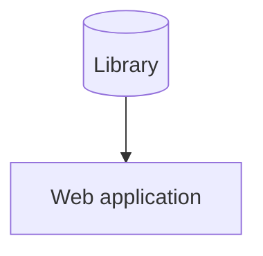

# Description
Entity framework

## Scenario
 
Prerequisites:
 - MySQL knowledge
 - Entity Framework knowledge

Your company has a monolithic web application that connects to a database which stores all of the data used by the different parts of the web application.. The application makes use of a 
Data Access Layer to connect to the database, i.e. developers need to manually write queries to query data.

Management recently started hearing about Entity Framework and task you to convert the application to use EF.

How do you go about updating the web application?

An example of the database structure is illustrated below:
```
Sales schema
 - Customer Table
 - Invoice Table
 - Inventory Table
Company schema
 - Employee Table
 - Department Table
 - Contracy Table
 - Invoice Table
Social schema
 - Calendar Table
 - Attendee Table
 - RSVP Table
```

The system diagram is displayed below:



### Additional information
 - N/A

### Guiding questions
 - N/A
 
 ### Assignment
 Answer the question presented in the Scenario section by means of a branch based on main. 
 Make use of text, voice notes, videos, diagrams, or anything else that will help you answer the question
 and get your point across.

The candidate is not expected to spend longer than 15 minutes on this question, however, the canidate is allowed to spend more time.